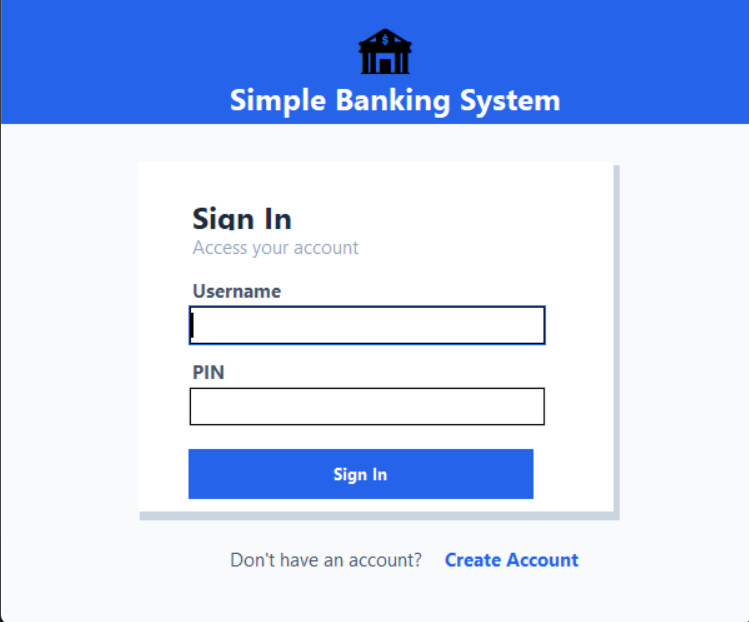
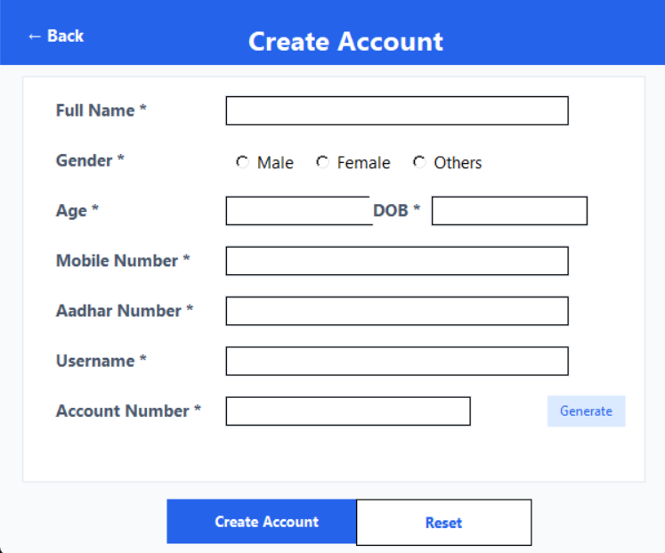
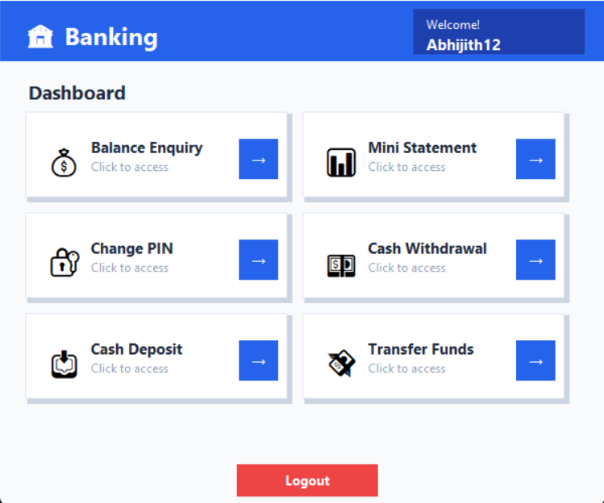

# 🏦 Simple Banking System

A modern, desktop-based banking application built with **Python**, **Tkinter**, and **SQLite3**. This project features a sophisticated UI inspired by **Bento** and **Liquid Glass** design principles, offering a seamless user experience for basic financial management.


---

## 📸 Interface Preview

<div align="center">
  <table>
    <tr>
      <td align="center"><b>Sign In</b></td>
      <td align="center"><b>Create Account</b></td>
      <td align="center"><b>Dashboard</b></td>
    </tr>
    <tr>
      <td></td>
      <td></td>
      <td></td>
    </tr>
  </table>
</div>

---
## ✨ Key Features

The application is structured into a logical, card-based **Dashboard** that provides essential banking services:

* **🔒 Secure Authentication:** PIN-based login system for registered users.
* **💰 Account Management:** Real-time balance enquiry and account creation with auto-generated account numbers.
* **💸 Financial Transactions:** Seamless cash deposits, withdrawals, and inter-user fund transfers.
* **📊 Mini Statements:** Comprehensive transaction history tracking with timestamps.
* **🔐 Security:** Easy-to-use "Change PIN" functionality to keep accounts secure.

---

## 🎨 Design Philosophy

This project moves away from the traditional "grey" look of Tkinter, implementing:
* **Bento Grid Layout:** Organized service cards for high scannability.
* **Glassmorphic Elements:** Subtle shadows and clean borders for a premium feel.
* **Modern Color Palette:** Utilizing `Segoe UI` fonts with a professional `Primary Blue (#2563EB)` and `Neutral Slate` color scheme.

---

## 🛠️ Tech Stack

| Component | Technology |
| :--- | :--- |
| **Language** | Python 3.x |
| **GUI Framework** | Tkinter |
| **Database** | SQLite3 (Local) |
| **Logic** | Procedural & Event-driven |

---

## 🚀 Getting Started

### Prerequisites
* Python 3.x installed on your system.
* `tkinter` (usually comes pre-installed with Python).

### Installation & Execution
1.  **Clone the repository:**
    ```bash
    git clone [https://github.com/abhijithshetty12/Simple-Banking-System.git](https://github.com/abhijithshetty12/Simple-Banking-System.git)
    cd Simple-Banking-System
    ```
2.  **Run the application:**
    ```bash
    python "Simple Banking System.py"
    ```

---

## 📂 Project Structure

```text
Simple-Banking-System/
├── Simple Banking System.py  # Main application logic and UI
├── ATMdatabase.db            # SQLite database (auto-generated)
└── README.md                 # Project documentation
